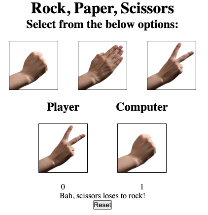

# The Odin Project - Rock Paper Scissors

This is a solution to
the [Rock Paper Scissors challenge](https://www.theodinproject.com/paths/foundations/courses/foundations/lessons/rock-paper-scissors)
on [The Odin Project](https://www.theodinproject.com/).

## The challenge
- Create a game of rock, paper, scissors.
- Create three buttons, one for each selection. Add an event listener to the buttons that calls your playRound function with the correct playerSelection every time a button is clicked.
- Add a div for displaying results.

## Screenshot

## Links

- [Solution](https://github.com/LandonRGeorge/odin-rock-paper-scissors)
- [Live Site](https://landonrgeorge.github.io/odin-rock-paper-scissors/)

## Built with

- HTML
- CSS (including Flexbox)
- JavaScript